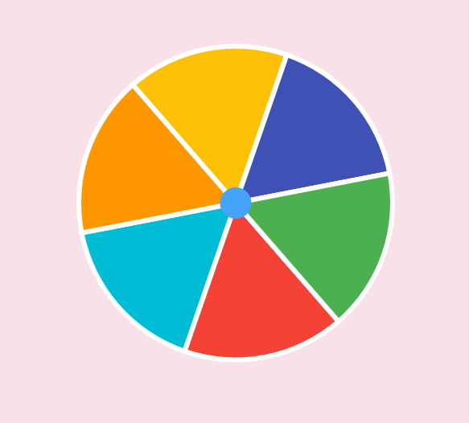
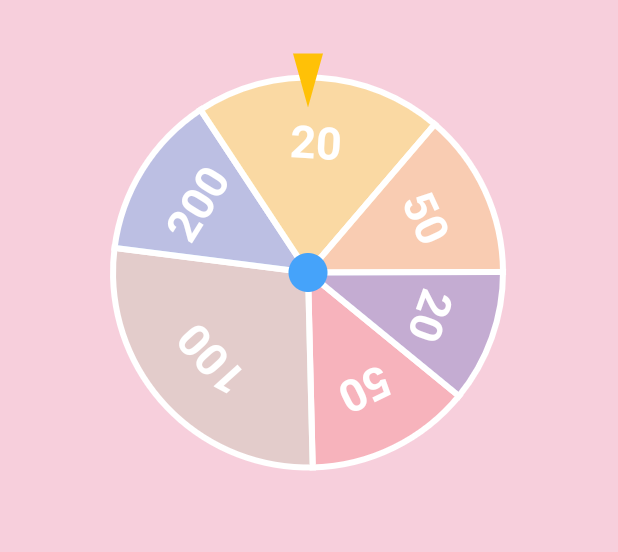

This is a library provide a simple roulette widget which usually used for lottery.

## Features

* Quickly build roulettes
* Build roulettes with different parts depends on the weight
* Easily control the roll animation and settle position
* There are two types of roulette provided by this package:

  * Uniform roulette without text:
    

  * Weight roulette with text:
    

## Getting started

## Usage

### Build a Roulette widget

First, you need to create a `RouletteController` instance.

```dart
RouletteController(
  group: RouletteGroup([
    RouletteUnit.noText(color: Colors.red),
    RouletteUnit.noText(color: Colors.green),
    // ...other units
  ]),
  vsync: this // provide a TickerProvider here
);
```

Once you have a controller, you could add a `Roulette` widget into your widget tree:

```dart
@override
Widget build(BuildContext context) {
  return Roulette(
    controller: controller, // provide your controller here
    style: RouletteStyle(
      // config the roulette's appearance here
    ),
  );
}
```

### Run the Roulette

Use roll method to run the roulette where you need to.

```dart
ElevatedButton(
  onPressed: () => controller.rollTo(2), // provide the index you want to settle
  child: const Text('Roll!'),
);
```

You could await the `rollTo` method's finish and then make some other actions.

The `rollTo` method provides many options for you to control the rolling behavior. Please check the document for more information.

For detailed usage sample, please check the example.
